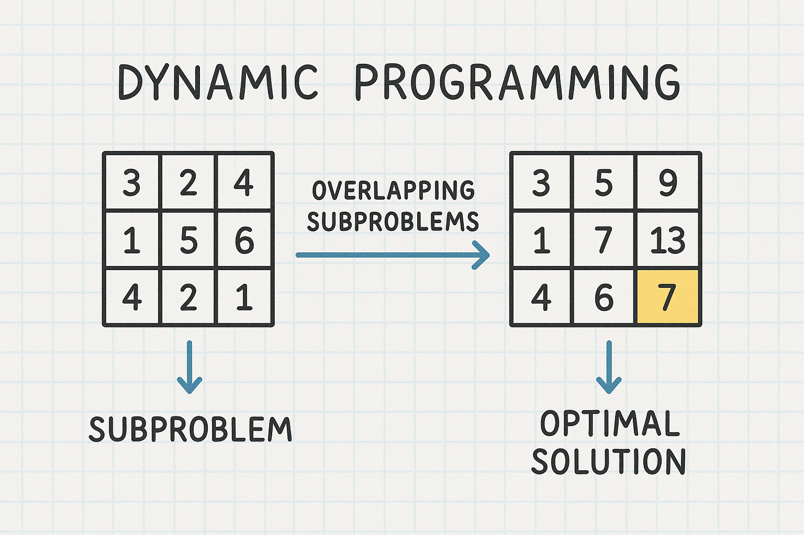
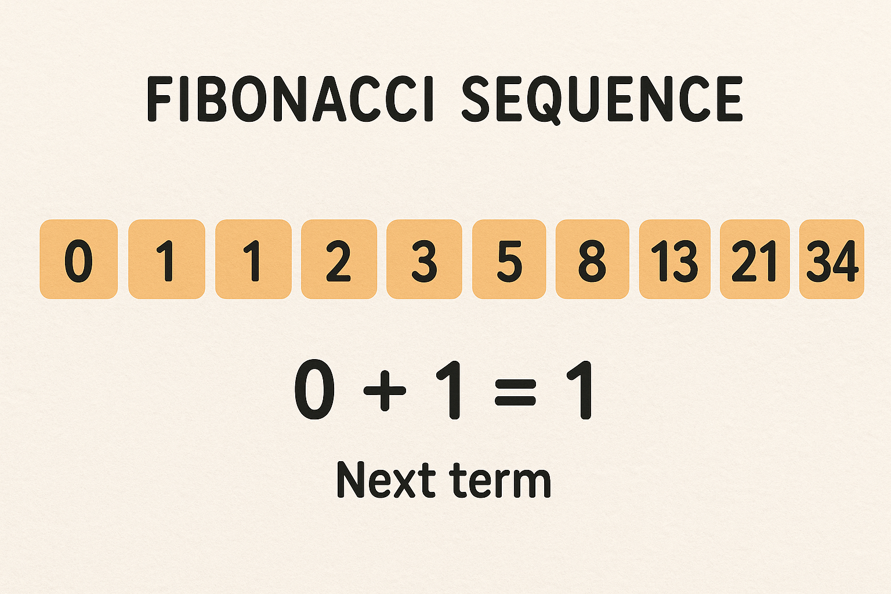
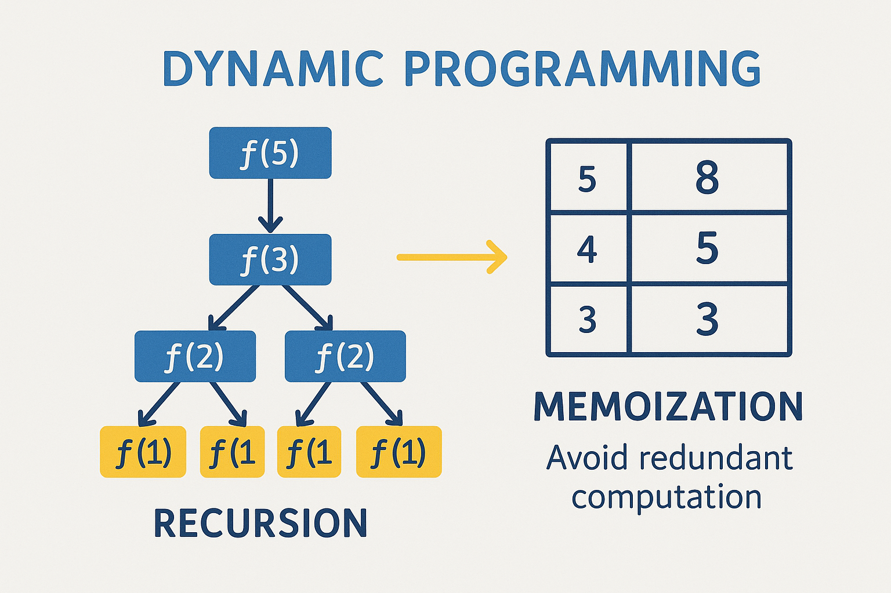
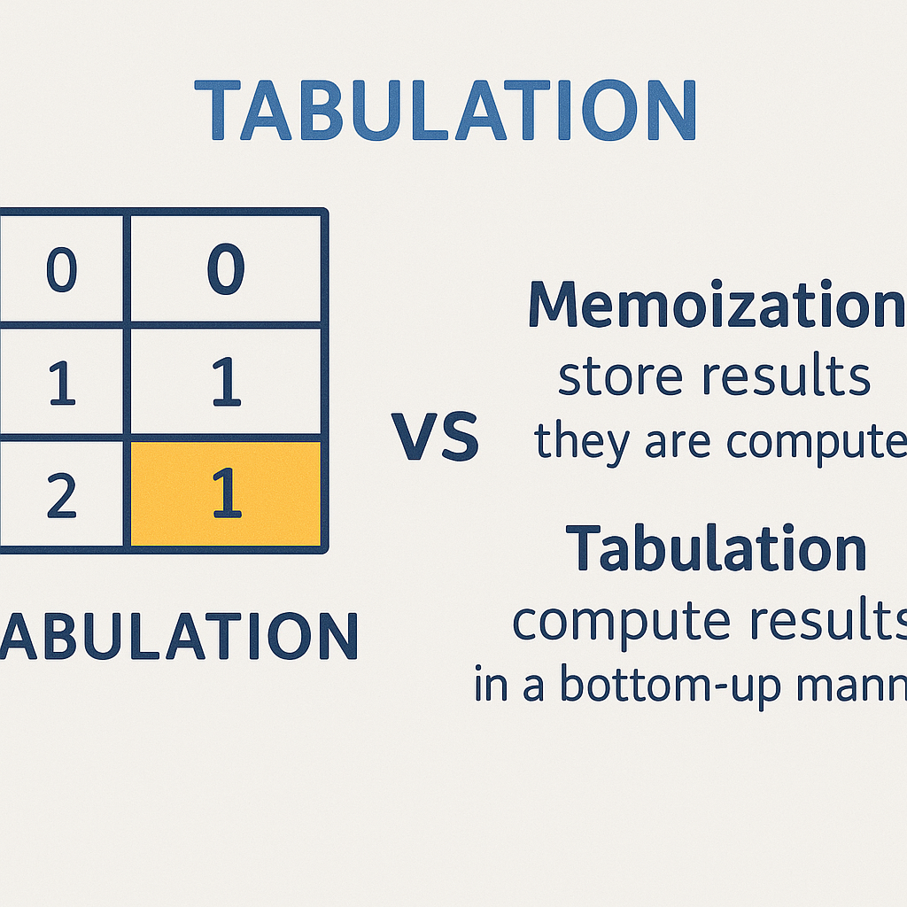

# Dynamic Programming (DP) Basics

## 📖 Theory:

### What is DP? (Recursion + Memoization / Tabulation)
Dynamic Programming (DP) is an optimization technique that solves complex problems by breaking them down into simpler subproblems. It combines:
- **Recursion**: The process of solving a problem by solving smaller instances of the same problem.
- **Memoization/Tabulation**: Storing solutions to subproblems to avoid redundant computations.



---

### Optimal Substructure and Overlapping Subproblems
Two key properties that make a problem suitable for DP:
1. **Optimal Substructure**: An optimal solution to the problem can be constructed from optimal solutions of its subproblems.
2. **Overlapping Subproblems**: The problem can be broken down into subproblems that are reused multiple times.

Example: Fibonacci sequence where `fib(5)` requires `fib(3)` and `fib(4)`, and `fib(3)` is reused in `fib(4)`.



---

### Difference Between Memoization (Top-Down) and Tabulation (Bottom-Up)
| Feature          | Memoization (Top-Down)                          | Tabulation (Bottom-Up)                     |
|------------------|-----------------------------------------------|-------------------------------------------|
| Approach         | Recursive, solves top problem first           | Iterative, solves smallest subproblems first |
| Storage          | Caches results as needed (lazy evaluation)    | Fills table in order (eager evaluation)    |
| Space Efficiency | May not use all table entries                  | Uses entire table                          |
| Code Complexity  | Often simpler to implement                    | May require more upfront planning          |

  

#### Memoization Example (Top-Down):
```swift
func fib(_ n: Int, _ memo: inout [Int: Int]) -> Int {
    if let result = memo[n] { return result }
    if n <= 2 { return 1 }
    memo[n] = fib(n-1, &memo) + fib(n-2, &memo)
    return memo[n]!
}

// Usage:
var memo = [Int: Int]()
print(fib(10, &memo))  // Output: 55
```


#### Tabulation Example in Swift (Bottom-Up):
```swift
func fib(_ n: Int) -> Int {
    if n <= 1 { return n }
    var table = [Int](repeating: 0, count: n+1)
    table[1] = 1
    for i in 2...n {
        table[i] = table[i-1] + table[i-2]
    }
    return table[n]
}

// Usage:
print(fib(10))  // Output: 55
```
